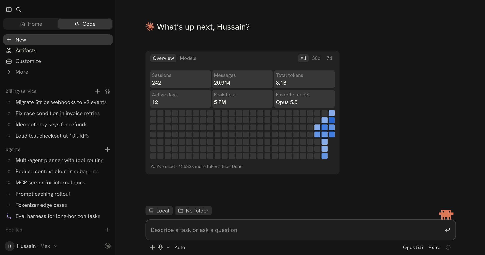

# LARPcode

**Flex Claude Code usage you never earned.**

LARPcode is a pixel-faithful replica of the Claude desktop app's Code tab, including the usage stats card everyone screenshots. Every number on it is yours to make up: sessions, messages, total tokens, active days, peak hour, favorite model, and the activity heatmap. When you've got the stats you want, take a screenshot and post it.

**Live:** https://hussainn7.github.io/LARPcode/



> ⭐ **If LARPcode made you look cracked, star the repo.** Stars are the only stat on here we can't fake.

## What you can fake

- **Every stat tile.** Click any number on the card and type over it. Shorthand works: `69.4B`, `1.2k`, `4 trillion`, `5 pm`.
- **The heatmap.** Click a cell to bump it up a level, or drag across the grid to paint. One-click patterns: daily grind, ramping up, weekdays only, weekends only, chaos, max out, and clear.
- **All / 30d / 7d.** The 30d and 7d numbers scale from your all-time totals based on how much heatmap activity falls inside each window. You can override any of them.
- **The Models tab.** Set each model's share of your tokens.
- **The fun fact.** Pick from the same book list Claude Code uses ("You've used ~12533× more tokens than Dune."), or write your own line.
- **The rest of the window.** Your name and plan, the greeting, sidebar projects and sessions (click to rename, or shuffle), the composer's model/effort/mode labels, Clawd, and macOS traffic lights.
- **Presets.** Fresh install, Weekend hacker, Staff engineer, Token whale, Unhinged, or *Surprise me*.

## Getting the screenshot

| Key | Action |
| --- | --- |
| `S` | Screenshot mode. Hides every editing control. |
| `Esc` / double-click | Leave screenshot mode |
| `E` | Show or hide the editor panel |

From the editor you can also:

- **Download a PNG** of the greeting and card at 2× resolution.
- **Go fullscreen** for a clean full-window screenshot.
- **Copy a share link.** Your whole setup is packed into the URL, so anyone who opens it sees exactly your stats.

Add `?shot` to the URL to open straight into screenshot mode.

## How it was matched

Spacing and colors were measured off real screenshots of the Claude desktop app, mostly to within a pixel: the 480px card, 26-week heatmap, tile radii, and the neutral dark palette (`#151515` window, `#111111` sidebar, `#212121` card, `#373737` tiles, and four heatmap blues from `#86acea` to `#2666d0`).

Claude's UI font, Anthropic Sans, is proprietary and isn't included here. LARPcode uses [Hanken Grotesk](https://fonts.google.com/specimen/Hanken+Grotesk) instead. Twenty Google Fonts were measured against Anthropic Sans, and Hanken Grotesk came closest: glyph width within 0.1% and x-height within 1.5%. Font sizes are scaled up 3% to match cap height. If you have Anthropic Sans installed locally, the page uses it automatically.

## Run it locally

It's a static site with no build step:

```bash
git clone https://github.com/hussainn7/LARPcode.git
cd LARPcode
python3 -m http.server 8000
```

Then open http://localhost:8000. ES modules don't load over `file://`, so you do need a local server.

## Deploy your own

1. Fork the repo.
2. Go to **Settings → Pages**.
3. Under **Build and deployment**, choose **Deploy from a branch**, then pick `main` and `/ (root)`.
4. After about a minute, the site is live at `https://<you>.github.io/LARPcode/`.

This repo itself publishes from the `gh-pages` branch. A small workflow (`.github/workflows/pages.yml`) mirrors `main` onto it on every push, so pushing to `main` is all it takes to update the live site.

## Project layout

```
index.html            app shell, icon sprite
assets/css/app.css    the replica
assets/css/studio.css the editor panel, screenshot mode, toasts
assets/js/main.js     boot, keyboard shortcuts
assets/js/state.js    store, persistence, share-link sanitizing
assets/js/data.js     defaults, presets, book list, sidebar pool
assets/js/stats.js    heatmap math, range scaling, fun fact
assets/js/card.js     stats card + Models tab
assets/js/render.js   sidebar, greeting, composer
assets/js/edit.js     click-to-edit and heatmap painting
assets/js/studio.js   editor panel
assets/js/share.js    screenshot mode, PNG export, share links
```

## Disclaimer

This is a parody made for fun. It is not affiliated with, endorsed by, or connected to Anthropic. Claude, Claude Code, and the Claude logo are trademarks of Anthropic. Nothing here talks to Anthropic or reads real usage data, and any numbers you see in a LARPcode screenshot are made up.

## License

[MIT](LICENSE) © Hussain
